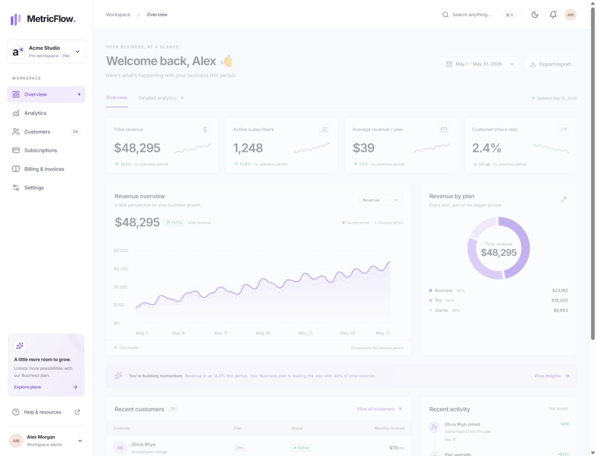

# MetricFlow — SaaS Analytics Dashboard

A complete, interactive frontend portfolio project for subscription businesses. MetricFlow brings revenue, acquisition, customers, subscriptions, and invoices into one responsive workspace.

[Source code on GitHub](https://github.com/jjjcheng/metricflow-dashboard)



## The project

Built to demonstrate thoughtful interface design and practical React engineering: a consistent visual system, useful interactions, accessible dialogs, clear data presentation, and responsive layouts. All accounts and metrics are fictional. No authentication service, database, payment processor, or email provider is connected.

## Features

| Page          | What you can do                                                                                              |
| ------------- | ------------------------------------------------------------------------------------------------------------ |
| Overview      | Switch reporting periods, explore revenue and plan charts, export revenue, and open recent customer records. |
| Analytics     | Compare acquisition channels, inspect a conversion funnel, and export traffic reports.                       |
| Customers     | Search, filter, sort, paginate, select and export accounts, add customers, and edit their details.           |
| Subscriptions | Explore three plans, filter subscriptions, change plans, cancel, and reactivate sample subscriptions.        |
| Billing       | Filter and search historical invoices, inspect invoice details, and download CSV records.                    |
| Settings      | Update your profile and workspace, toggle notification preferences, choose a theme, and reset demo data.     |

Global search supports **Ctrl/Cmd + K**. Customer records and workspace preferences persist in browser storage and synchronize between tabs. Light, dark, and system themes are supported. Mobile navigation and dialogs include focus management and keyboard controls.

## Stack

- Next.js 16 App Router, React 19, TypeScript
- Tailwind CSS 4 and a custom CSS token system
- shadcn/ui-style source components built with Radix UI, CVA, and tailwind-merge
- Lucide icons and locally bundled Inter Variable fonts
- next-themes for theme persistence
- Custom responsive SVG charts with mouse and keyboard data inspection
- ESLint and Prettier

Exact dependency versions and the lockfile are committed for reproducible installs. The UI requires no external image or font service at runtime.

## Run locally

Use Node.js 22 or newer.

```bash
npm ci
npm run dev
```

Open [localhost:3000](http://localhost:3000).

```bash
npm run lint
npm run typecheck
npm run build
npm start
```

`npm run format` formats the application source. No environment variables are needed.

## Structure

```text
src/
  app/                  Next.js routes, metadata, loading and error pages
  components/           Page features and shared workspace shell
    ui/                 Reusable button and accessible dialog primitives
    providers.tsx       Validated, persistent browser workspace store
  lib/
    data.ts             Typed fixtures and reporting period calculations
    utils.ts            Formatting, class names, safe CSV export
```

## Data model and boundaries

- Analytics represents a fictional May 2026 reporting snapshot, with weekly and three-month views. Revenue chart values reconcile with their displayed period totals. Previous-period chart values are modeled from the comparison total.
- The customer directory contains **24 editable sample accounts**, a subset of the larger historical analytics dataset. Editing these records intentionally does not rewrite historical business metrics.
- The billing page contains **18 fixed historical sample invoices**. Plan changes affect current subscriptions, not past invoice amounts.
- Local changes are stored under `metricflow-workspace-v1`. Reset them from **Settings → Reset demo**. Clearing browser storage also restores defaults.
- In a production integration, replace the browser store with authenticated server APIs, a database, tenant authorization, and validated billing-provider webhooks. Those services are outside this frontend demo.

## Deploy to Vercel

1. Push the repository to GitHub.
2. Import that repository in Vercel and select the Next.js preset.
3. Keep the root directory at the repository root. Use `npm run build` and the default Next.js output settings.
4. Deploy. No secrets or environment variables are required.

The routes are prerendered, with interactive functionality hydrated on the client. Subsequent pushes to the linked production branch can trigger deployments.

## Portfolio

The `portfolio/` directory contains the English case study, screenshot captions, and the verification notes used for the Upwork showcase. Screenshots represent the actual application; the displayed business growth is fictional demo data, not a claimed client result.
